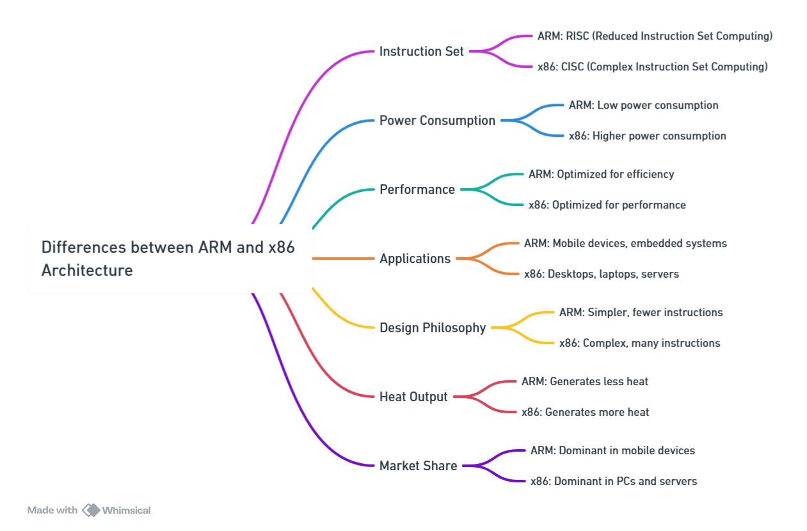
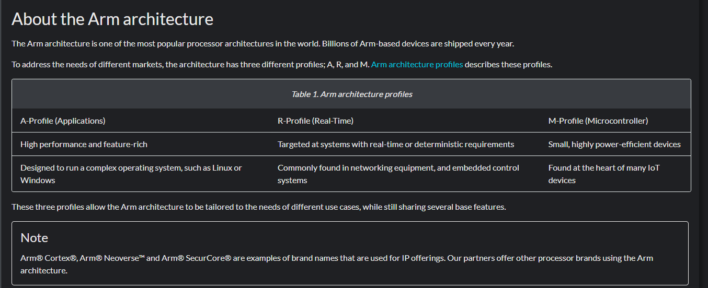
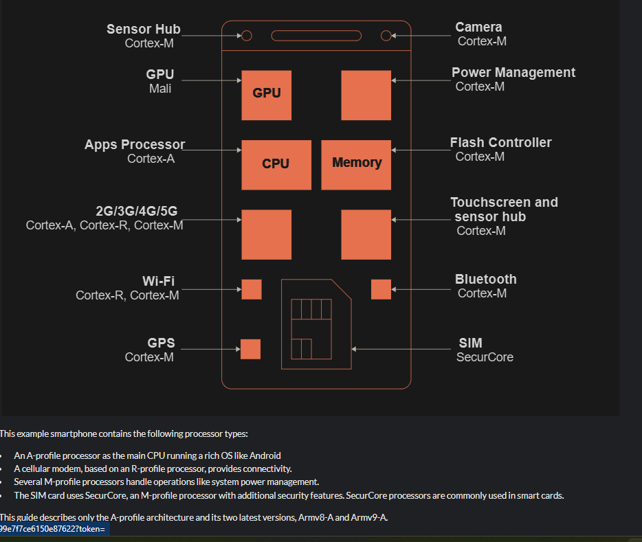

ARM Architecture Overview

ARM (Advanced RISC Machines) is a family of Reduced Instruction Set Computing (RISC) architectures used widely in embedded systems, smartphones, tablets, and microcontrollers. ARM processors are known for their low power consumption, making them ideal for battery-powered devices and real-time embedded applications.

To explore official documentation and updates, visit:  
🔗 https://developer.arm.com 
https://developer.arm.com/documentation/102404/0203?lang=en

---

📌 ARM vs x86

- **ARM:**
  - RISC (Reduced Instruction Set Computing)
  - Fewer, simpler instructions
  - Lower power consumption
  - Common in mobile, IoT, and embedded devices

- **x86:**
  - CISC (Complex Instruction Set Computing)
  - More powerful instructions, larger footprint
  - Higher power consumption
  - Common in desktops, laptops, and servers
  

Cortex-A, Cortex-R, Cortex-M differences (wE focus on Cortex-M as we Work on Bluepill microcontroller)
https://gsasindia.com/blog/cortex-a-cortex-r-and-cortex-m/

