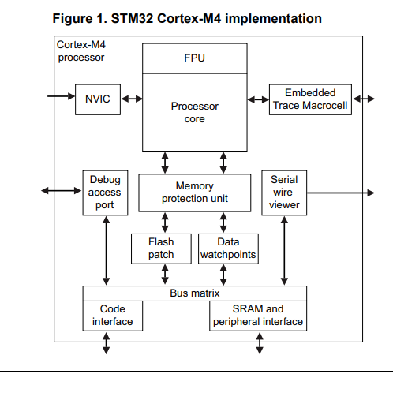
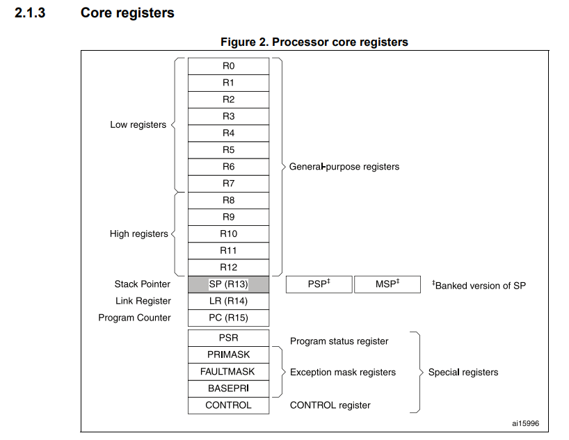
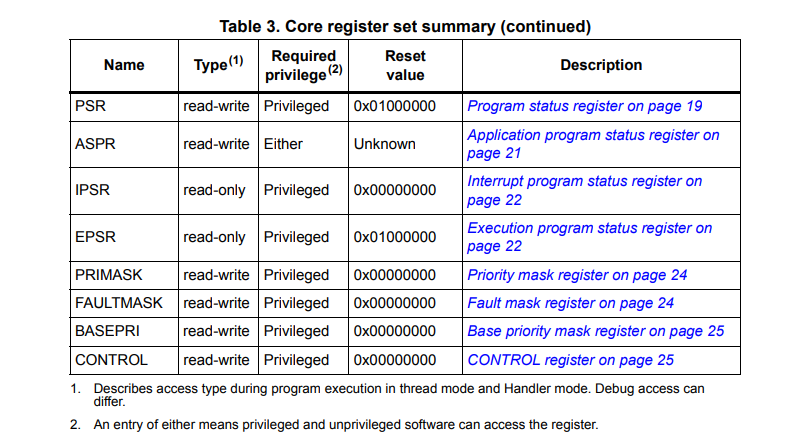
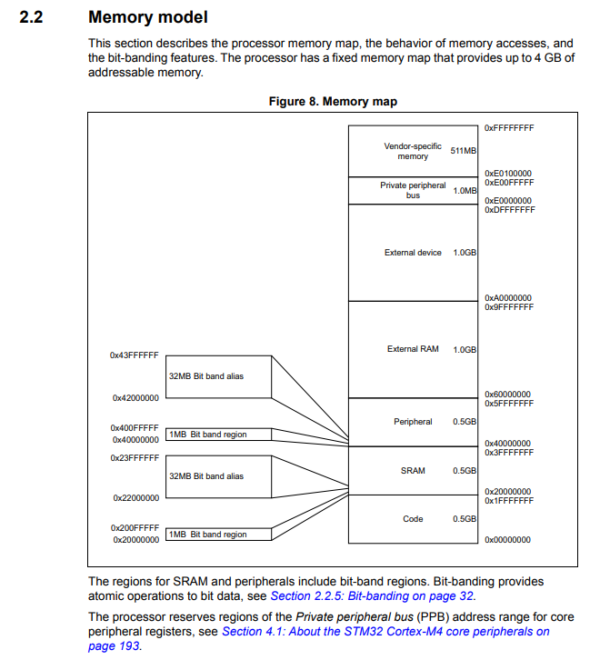

# About the STM32 Cortex-M4 processor and core peripherals
**The Cortex-M4 processor** is a high performance 32-bit processor designed for the
microcontroller market. It offers significant benefits to developers, including:
• outstanding processing performance combined with fast interrupt handling
• enhanced system debug with extensive breakpoint and trace capabilities
• efficient processor core, system and memories
• ultra-low power consumption with integrated sleep modes
• platform security robustness, with integrated memory protection unit (MPU)

**Programmers model**
This section describes the Cortex-M4 programmer’s model. In addition to the individual core
register descriptions, it contains information about the processor modes and privilege levels
for software execution and stacks.
2.1.1 Processor mode and privilege levels for software execution
The processor modes are:
**Thread mode**: Used to execute application software.
The processor enters Thread mode when it comes out of reset.
The CONTROL register controls whether software execution is
privileged or unprivileged, see CONTROL register on page 25.
**Handler mode**: Used to handle exceptions.
The processor returns to Thread mode when it has finished exception
processing.
Software execution is always privileged.

The privilege levels for software execution are:

**Unprivileged**: Unprivileged software executes at the unprivileged level and:
• Has limited access to the MSR and MRS instructions, and cannot
use the CPS instruction.
• Cannot access the system timer, NVIC, or system control block.
• Might have restricted access to memory or peripherals.
• Must use the SVC instruction to make a supervisor call to transfer
control to privileged software.
**Privileged**: Privileged software executes at the privileged level and can use all the
instructions and has access to all resources.
Can write to the CONTROL register to change the privilege level for
software execution.

**Memory Map of the STM32 M4 Architecture**

